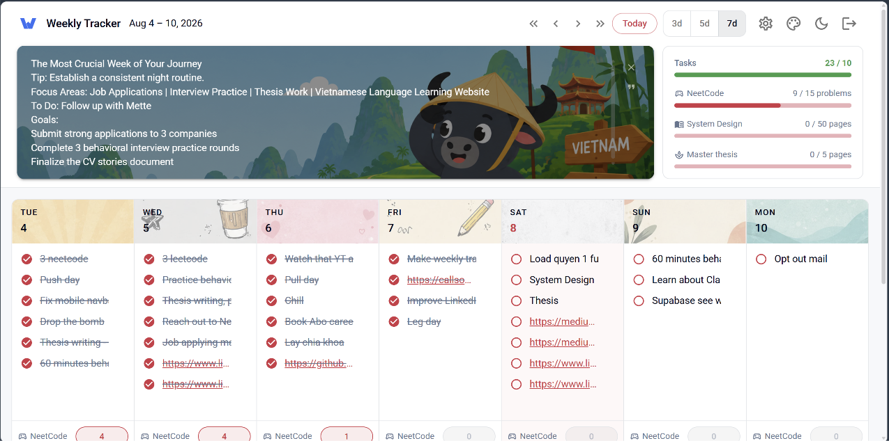

# Datewise

**A weekly productivity tracker that combines a calendar, a todo list, and habit streaks into one screen.**

Plan the week in a Google-Calendar-style grid, tick things off, and watch weekly goals fill up in real time — no sign-up required, no save button, nothing to configure before you start.

🔗 **[Live app →](https://todop.lovable.app)**



---

## Why it exists

Most trackers make you choose: a calendar that can't count, or a habit app that can't plan. Datewise puts both in the same grid — each day column holds that day's tasks on top and that day's habit counters underneath, with the week's aggregate goals always visible in the corner. One glance answers "what's left today?" and "am I on track this week?".

## Highlights

| | |
|---|---|
| **Zero-friction entry** | First visit silently provisions an anonymous Supabase session, so the app is fully usable in one second. Sign up later and the guest data is carried into the real account. |
| **Optimistic everything** | Every mutation writes to the TanStack Query cache first and rolls back on failure. Checking a box, typing a habit value, dragging a task — the UI never waits on the network. |
| **Cross-day drag & drop** | `@dnd-kit` sortable contexts per day, so tasks reorder within a day *and* move between days with live drop indicators, on mouse and touch. |
| **Server-side link previews** | Paste a URL into a task and a TanStack Start server function fetches its `og:title` — with an SSRF guard on private address ranges and a 5s abort timeout — so the row shows a readable title instead of a raw URL. |
| **Flash-free theming** | 7 accent colours × light/dark are Material UI colour schemes applied to `<html>` before hydration. No theme flash, no layout shift, preference persisted. |
| **Adjustable span** | Switch between a 3-day, 5-day, or 7-day view; the choice persists, and the current day's column is tinted. |
| **Weekly rituals** | Per-week focus banner and rotating quote collection, per-day illustrated header art (32 hand-cropped WebP tiles, light + dark variants), confetti and a synthesized WebAudio chime when a goal is hit. |
| **Secure by construction** | Every table is row-level-secured against `auth.uid()`; the client is never trusted to scope a query. |

## Architecture

```
Browser (React 19)                    Server (TanStack Start → Nitro → Cloudflare)
┌──────────────────────────┐          ┌────────────────────────────────────┐
│ TrackerApp               │          │ SSR entry (src/server.ts)          │
│  ├─ StatsPanel           │          │  └─ error-boundary wrapper         │
│  ├─ QuotePanel           │  ◄────►  │ Server functions                   │
│  ├─ SettingsDialog       │          │  └─ fetchLinkPreview (SSRF-guarded)│
│  └─ dnd-kit day columns  │          │ requireSupabaseAuth middleware     │
│ TanStack Query cache     │          └────────────────────────────────────┘
│  └─ optimistic mutations │                          │
└──────────────────────────┘                          ▼
             │                          ┌────────────────────────────────┐
             └────────────────────────► │ Supabase — Postgres + Auth     │
                    supabase-js         │ RLS: auth.uid() = user_id      │
                                        └────────────────────────────────┘
```

**Data model** — `todos`, `habits`, `habit_entries`, `settings`, `day_notes`, `weekly_backgrounds`, `weekly_quotes`, `quote_collections`. Composite `(user_id, date)` indexes keep the week query to a single indexed range scan per table; `habit_entries` is uniquely keyed on `(habit_id, date)` so a day's value is a plain upsert rather than a read-modify-write.

**Query strategy** — the visible week is the cache key. Navigating weeks swaps keys, so previously-visited weeks render instantly from cache while revalidating in the background.

## Tech stack

- **React 19** + **TypeScript** (strict)
- **TanStack Start** — full-stack React with SSR, file-based routing and typed server functions
- **TanStack Query** — server-state cache, optimistic updates, rollback
- **Material UI v9** — theming and components, styled entirely through the theme + `sx`
- **Supabase** — Postgres, Auth (incl. anonymous sessions), Row Level Security
- **@dnd-kit** — accessible drag & drop
- **Motion** + **canvas-confetti** + **WebAudio** — micro-interactions
- **Vite 8**, ESLint, Prettier; deployed to **Cloudflare** via Nitro

## Engineering notes

A few decisions worth calling out:

- **Anonymous-first auth.** Rather than gating the app behind a login wall, `signInAnonymously()` runs on first paint and `onAuthStateChange` promotes the session in place when the user later registers. The tradeoff — anonymous rows accumulate — is bounded by `ON DELETE CASCADE` from `auth.users`.
- **The server function is the trust boundary.** Link previews can't run in the browser (CORS) and can't be trusted to run unvalidated on the server (SSRF), so `fetchLinkPreview` validates protocol, rejects loopback/link-local/RFC-1918 hostnames, caps the fetch with an `AbortController`, and returns only a title string — never the fetched body.
- **Theme without the flash.** The naive `useEffect` theme toggle paints the wrong colours for one frame. Using MUI colour schemes with a pre-hydration class means the very first painted frame is already correct, including the accent.
- **Optimistic mutations with real rollback.** Each `useMutation` snapshots the affected cache slice in `onMutate` and restores it in `onError`, so a dropped connection degrades to "the change reverts" rather than "the UI lies".

## Running locally

Requires [Bun](https://bun.sh) (or npm) and a Supabase project.

```sh
git clone <this-repository-url>
cd todop
bun install

# Configure Supabase
cp .env.example .env      # then fill in the values below
```

```env
# Client (Vite build-time replacement)
VITE_SUPABASE_URL=https://<project-ref>.supabase.co
VITE_SUPABASE_PUBLISHABLE_KEY=<publishable-key>

# Same values for SSR / server functions
SUPABASE_URL=https://<project-ref>.supabase.co
SUPABASE_PUBLISHABLE_KEY=<publishable-key>
```

Apply the schema, then start the dev server:

```sh
supabase db push          # runs supabase/migrations/*.sql
bun run dev               # http://localhost:5173
```

| Script | Description |
|---|---|
| `bun run dev` | Dev server with HMR |
| `bun run build` | Production build (Nitro → Cloudflare) |
| `bun run preview` | Preview the production build |
| `bun run lint` | ESLint |
| `bun run format` | Prettier |

## Project structure

```
src/
├─ routes/                  # File-based routes: /, /auth, /reset-password
├─ components/tracker/
│  ├─ TrackerApp.tsx        # Week grid, drag & drop, mutations
│  ├─ StatsPanel.tsx        # Weekly goal progress
│  ├─ QuotePanel.tsx        # Per-week focus banner & quotes
│  └─ SettingsDialog.tsx    # Habits, goals, theme, sound
├─ integrations/supabase/   # Client, SSR client, auth middleware, generated types
└─ lib/                     # Theme, week math, link previews, celebration, sound
supabase/migrations/        # Schema + RLS policies
```
